import { Aside } from '@astrojs/starlight/components';

GitHub Agentic Workflows implements a defense-in-depth security architecture that protects against untrusted Model Context Protocol (MCP) servers and compromised agents. This document provides an overview of our security model and visual diagrams of the key components.

## Security Model

Agentic Workflows (AW) adopts a layered approach that combines substrate-enforced isolation, declarative specification, and staged execution. Each layer enforces distinct security properties under different assumptions and constrains the impact of failures above it.

### Threat Model

We consider an adversary that may compromise untrusted user-level components, e.g., containers, and may cause them to behave arbitrarily within the privileges granted to them. The adversary may attempt to:

- Access or corrupt the memory or state of other components
- Communicate over unintended channels
- Abuse legitimate channels to perform unintended actions
- Confuse higher-level control logic by deviating from expected workflows

We assume the adversary does not compromise the underlying hardware or cryptographic primitives. Attacks exploiting side channels and covert channels are also out of scope.

---

### Layer 1: Substrate-Level Trust

AWs run on a GitHub Actions runner virtual machine (VM) and trust Actions' hardware and kernel-level enforcement mechanisms, including the CPU, MMU, kernel, and container runtime. AWs also rely on two privileged containers: (1) a network firewall that is trusted to configure connectivity for other components via 'iptables' and launch the agent container, and (2) an MCP Gateway that is trusted to configure and spawn isolated MCP-server containers. Collectively, the substrate level ensures memory isolation between components, CPU and resource isolation, mediation of privileged operations and system calls, and explicit, kernel-enforced communication boundaries. These guarantees hold even if an untrusted user-level component is fully compromised and executes arbitrary code. Trust violations at the substrate level require vulnerabilities in the firewall, MCP Gateway, container runtime, kernel, hypervisor, or hardware. If this layer fails, higher-level security guarantees may not hold.

---

### Layer 2: Configuration-Level Trust

AW trusts declarative configuration artifacts, e.g., Action steps, network-firewall policies, MCP server configurations, and the toolchains that interpret them to correctly instantiate system structure and connectivity. The configuration level constrains which components are loaded, how components are connected, which communication channels are permitted, and what component privileges are assigned. Externally minted authentication tokens, e.g., agent API keys and GitHub access tokens, are a critical configuration input and are treated as imported capabilities that bound components' external effects; declarative configuration controls their distribution, e.g., which tokens are loaded into which containers. Security violations arise due to misconfigurations, overly permissive specifications, and limitations of the declarative model. This layer defines what components exist and how they communicate, but it does not constrain how components use those channels over time.

---

### Layer 3: Plan-Level Trust

AW additionally relies on plan-level trust to constrain component behavior over time. At this layer, the trusted compiler decomposes a workflow into stages. For each stage, the plan specifies (1) which components are active and their permissions, (2) the data produced by the stage, and (3) how that data may be consumed by subsequent stages. In particular, plan-level trust ensures that important external side effects are explicit and undergo thorough vetting.

A primary instantiation of plan-level trust is the **SafeOutputs** subsystem. SafeOutputs is a set of trusted components that operate on external state. An agent can interact with read-only MCP servers, e.g., the GitHub MCP server, but externalized writes, such as creating GitHub pull requests, are buffered as artifacts by SafeOutputs rather than applied immediately. When the agent finishes, SafeOutputs' buffered artifacts can be processed by a deterministic sequence of filters and analyses defined by configuration. These checks can include structural constraints, e.g., limiting the number of pull requests, policy enforcement, and automated sanitization to ensure that sensitive information such as authentication tokens are not exported. These filtered and transformed artifacts are passed to a subsequent stage in which they are externalized.

Security violations at the planning layer arise from incorrect plan construction, incomplete or overly permissive stage definitions, or errors in the enforcement of plan transitions. This layer does not protect against failures of substrate-level isolation or mis-allocation of permissions at credential-minting or configuration time. However, it limits the blast radius of a compromised component to the stage in which it is active and its influence on the artifacts passed to the next stage.


## Component Overview

The security architecture operates across multiple layers: compilation-time validation, runtime isolation, permission separation, network controls, and output sanitization. The following diagram illustrates the relationships between these components and the flow of data through the system.


## Safe Outputs: Permission Isolation

The SafeOutputs subsystem enforces permission isolation by ensuring that agent execution never has direct write access to external state. The agent job runs with minimal read-only permissions, while write operations are deferred to separate jobs that execute only after the agent completes. This separation ensures that even a fully compromised agent cannot directly modify repository state.

```mermaid
flowchart LR
    subgraph AgentJob["Agent Job<br/>🔐 Read-Only Permissions"]
        AGENT["AI Agent Execution"]
        OUTPUT[/"agent_output.json<br/>(Artifact)"/]
        AGENT --> OUTPUT
    end

    subgraph Detection["Threat Detection Job"]
        ANALYZE["Analyze for:<br/>• Secret Leaks<br/>• Malicious Patches"]
    end

    subgraph SafeJobs["Safe Output Jobs<br/>🔓 Write Permissions (Scoped)"]
        direction TB
        ISSUE["create_issue<br/>issues: write"]
        COMMENT["add_comment<br/>issues: write"]
        PR["create_pull_request<br/>contents: write<br/>pull-requests: write"]
        LABEL["add_labels<br/>issues: write"]
    end

    subgraph GitHub["GitHub API"]
        API["GitHub REST/GraphQL API"]
    end

    OUTPUT -->|"Download Artifact"| ANALYZE
    ANALYZE -->|"✅ Approved"| SafeJobs
    ANALYZE -->|"❌ Blocked"| BLOCKED["Workflow Fails"]

    ISSUE --> API
    COMMENT --> API
    PR --> API
    LABEL --> API
```



<Aside type="tip">
The SafeOutputs subsystem provides security by design: the agent never requires write permissions because all write operations are performed by separate, validated jobs with minimal scoped permissions.
</Aside>

## Agent Workflow Firewall (AWF)

The Agent Workflow Firewall (AWF) containerizes the agent, binds it to a Docker network, and uses iptables to redirect HTTP/HTTPS traffic through a Squid proxy container. The Squid proxy controls the agent's egress traffic via a configurable domain allowlist to prevent data exfiltration and restrict compromised agents to permitted domains. The AWF setup process drops its iptables capabilities before launching the agent. 

Containerizing an agent improves security by limiting its access to the host, but this may come at a cost. In particular, many coding agents expect full access to the host and break if containerized naively. To support agents that need more access to the host, AWF provides a more permissive 'chroot mode' that mounts a subset of host system directories read-only under '/host', mounts the host's HOME and '/tmp' directories read-write, imports a subset of host environment variables like USER and PATH, and then launches the agent in a '/host' chroot jail. This allows the agent to safely use host-installed binaries (Python, Node.js, Go, etc.) from their normal paths, while controlling access to the host network, environment variables, and other sensitive resources.

Thus, AWF separates two concerns:
- **Filesystem**: Controlled access to host binaries and runtimes via chroot
- **Network**: All traffic routed through proxy enforcing the domain allowlist

```mermaid
flowchart TB
    subgraph Agent["AI Agent Process"]
        COPILOT["Copilot CLI"]
        WEB["WebFetch Tool"]
        SEARCH["WebSearch Tool"]
    end

    subgraph Firewall["Agent Workflow Firewall (AWF)"]
        WRAP["Process Wrapper"]
        ALLOW["Domain Allowlist"]
        LOG["Activity Logging"]

        WRAP --> ALLOW
        ALLOW --> LOG
    end

    subgraph Network["Network Layer"]
        direction TB
        ALLOWED_OUT["✅ Allowed Domains"]
        BLOCKED_OUT["❌ Blocked Domains"]
    end

    subgraph Ecosystems["Ecosystem Bundles"]
        direction TB
        DEFAULTS["defaults<br/>certificates, JSON schema"]
        PYTHON["python<br/>PyPI, Conda"]
        NODE["node<br/>npm, npmjs.com"]
        CUSTOM["Custom Domains<br/>api.example.com"]
    end

    COPILOT --> WRAP
    WEB --> WRAP
    SEARCH --> WRAP

    ALLOW --> ALLOWED_OUT
    ALLOW --> BLOCKED_OUT

    DEFAULTS --> ALLOW
    PYTHON --> ALLOW
    NODE --> ALLOW
    CUSTOM --> ALLOW

    ALLOWED_OUT --> INTERNET["🌐 Internet"]
    BLOCKED_OUT --> DROP["🚫 Dropped"]
```



**Configuration Example:**

```yaml wrap
engine: copilot

network:
  firewall: true
  allowed:
    - defaults     # Basic infrastructure
    - python       # PyPI ecosystem
    - node         # npm ecosystem
    - "api.example.com"  # Custom domain
```

## MCP Gateway and Firewall Integration

When the MCP gateway is enabled, it operates in conjunction with AWF to ensure that MCP traffic remains contained within trusted boundaries. The gateway spawns isolated containers for MCP servers while AWF mediates all network egress, ensuring that agent-to-server communication traverses only approved channels.


**Architecture Summary**

1. AWF establishes an isolated network with a Squid proxy that enforces the workflow `network.allowed` list.
2. The agent container can only egress through Squid. To reach the gateway, it uses `host.docker.internal:80` (Docker's host alias). This hostname must be included in the firewall's allowed list.
3. The `gh-aw-mcpg` container publishes host port 80 mapped to container port 8000. It uses the Docker socket to spawn MCP server containers.
4. All MCP traffic remains within the host boundary: AWF restricts egress, and the gateway routes requests to sandboxed MCP servers.

## MCP Server Sandboxing

MCP servers execute within isolated containers, enforcing substrate-level separation between the agent and each server instance. Tool filtering at the configuration level restricts which operations each server may expose, limiting the attack surface available to a compromised agent. This isolation ensures that even if an MCP server is compromised, it cannot access the memory or state of other components.

```mermaid
flowchart TB
    subgraph Agent["AI Agent"]
        ENGINE["AI Engine<br/>(Copilot, Claude, Codex)"]
    end

    subgraph MCPLayer["MCP Server Layer"]
        direction TB

        subgraph GitHub["GitHub MCP"]
            GH_TOOLS["Enabled Tools:<br/>• issue_read<br/>• list_commits<br/>• search_code"]
            GH_BLOCKED["Blocked Tools:<br/>• delete_repository<br/>• update_branch_protection"]
        end

        subgraph Custom["Custom MCP (Docker)"]
            CONTAINER["🐳 Isolated Container"]
            NET["Network Allowlist"]
            ENV["Env Var Injection"]
        end

        subgraph HTTP["HTTP MCP"]
            ENDPOINT["HTTPS Endpoint"]
            HEADERS["Secure Headers"]
        end
    end

    subgraph Toolfilter["Tool Filtering"]
        ALLOWED["allowed: [tool1, tool2]"]
        DENIED["❌ Unlisted tools blocked"]
    end

    ENGINE <-->|"stdio/HTTP"| GitHub
    ENGINE <-->|"stdio"| CONTAINER
    ENGINE <-->|"HTTP"| ENDPOINT

    ALLOWED --> GH_TOOLS
    ALLOWED --> GH_BLOCKED
    CONTAINER --> NET
    CONTAINER --> ENV
    ENDPOINT --> HEADERS
```



**Isolation Properties:**

- **Container Isolation**: Custom MCP servers run in Docker containers with no shared state
- **Network Controls**: Per-container domain allowlists enforced via Squid proxy
- **Tool Allowlisting**: Explicit `allowed:` lists restrict available operations
- **Secret Injection**: Secrets are passed via environment variables, never in configuration files

## Threat Detection Pipeline

The threat detection job is a sub-stage within the SafeOutputs subsystem. After the agent job completes and its outputs are buffered as artifacts, a separate detection job downloads these artifacts and invokes a prompted AI agent to analyze them for suspicious content. This detection agent operates with a security-focused system prompt and examines the agent's outputs, patches, and execution context. The detection job runs in isolation from the original agent and has no access to write permissions; its sole responsibility is to emit a pass/fail verdict that gates the subsequent safe output jobs.

Detection checks include identification of secret leakage, malicious code patterns, and policy violations. If the detection agent identifies threats, the workflow terminates before any writes are externalized. Workflow authors can customize detection behavior by providing additional detection prompts or integrating external security scanners.

```mermaid
flowchart TB
    subgraph Input["SafeOutputs Artifacts"]
        JSON[/"agent_output.json<br/>(Buffered actions)"/]
        PATCH[/"aw.patch<br/>(Git diff from agent)"/]
        PROMPT[/"prompt.txt<br/>(Original workflow context)"/]
    end

    subgraph DetectionJob["Threat Detection Job"]
        direction TB
        DOWNLOAD["Download artifacts"]
        AGENT["Detection Agent<br/>(Security-focused prompt)"]
        
        subgraph Checks["Analysis Targets"]
            SECRETS["Secret Leaks<br/>API keys, tokens<br/>Credentials in outputs"]
            MALICIOUS["Malicious Patches<br/>Backdoors, vulnerabilities<br/>Suspicious modifications"]
            POLICY["Policy Violations<br/>Scope violations<br/>Unauthorized operations"]
        end
        
        CUSTOM["Custom Detection Steps"]
    end

    subgraph Verdict["Verdict"]
        SAFE_CHECK{{"Threats<br/>Detected?"}}
    end

    subgraph Outcome["Outcome"]
        PROCEED["✅ Safe output jobs proceed"]
        BLOCK["❌ Workflow fails<br/>No writes externalized"]
    end

    JSON --> DOWNLOAD
    PATCH --> DOWNLOAD
    PROMPT --> DOWNLOAD
    
    DOWNLOAD --> AGENT
    AGENT --> Checks
    Checks --> CUSTOM
    CUSTOM --> SAFE_CHECK

    SAFE_CHECK -->|"No"| PROCEED
    SAFE_CHECK -->|"Yes"| BLOCK
```



**Detection Job Properties:**

- **Isolated Execution**: The detection agent runs in a separate job with no write permissions and no access to the original agent's runtime state
- **Prompted Analysis**: Detection uses the same AI engine as the workflow, but with a security-focused system prompt that instructs the agent to identify threats
- **Artifact-Based**: The detection agent only sees the buffered artifacts (outputs, patches, context), not live repository state
- **Blocking Verdict**: The detection job must complete successfully and emit a "safe" verdict before any safe output jobs execute

**Detection Mechanisms:**

- **AI Detection**: Default AI-powered analysis using the workflow engine with a security-focused detection prompt
- **Custom Steps**: Integration with security scanners (Semgrep, TruffleHog, LlamaGuard) via `threat-detection.steps` configuration
- **Custom Prompts**: Domain-specific detection instructions for specialized threat models via `threat-detection.prompt` configuration

**Configuration Example:**

```yaml wrap
threat-detection:
  prompt: |
    Additionally check for:
    - References to internal infrastructure URLs
    - Attempts to modify CI/CD configuration files
    - Changes to security-sensitive files (.github/workflows, package.json scripts)
  steps:
    - name: Run TruffleHog
      run: trufflehog filesystem /tmp/gh-aw --only-verified
    - name: Run Semgrep
      run: semgrep scan /tmp/gh-aw/aw.patch --config=auto
```

## Compilation-Time Security

AW enforces security constraints at compilation time through schema validation, expression allowlisting, and action pinning. The trusted compiler validates declarative configuration artifacts before they are deployed, rejecting misconfigurations and overly permissive specifications. This layer constrains what components may be loaded and how they may be connected, but it does not constrain runtime behavior.

```mermaid
flowchart TB
    subgraph Source["Source Files"]
        MD[/"workflow.md"/]
        IMPORTS[/"imports/*.md"/]
    end

    subgraph Validation["Schema & Expression Validation"]
        SCHEMA["JSON Schema Validation<br/>• Valid frontmatter fields<br/>• Correct types & formats"]
        EXPR["Expression Safety<br/>• Allowlisted expressions only<br/>• No secrets in expressions"]
    end

    subgraph Pinning["Action Pinning"]
        SHA["SHA Resolution<br/>actions/checkout@sha # v4"]
        CACHE[/"actions-lock.json<br/>(Cached SHAs)"/]
    end

    subgraph Scanners["Security Scanners"]
        ACTIONLINT["actionlint<br/>Workflow linting<br/>(includes shellcheck & pyflakes)"]
        ZIZMOR["zizmor<br/>Security vulnerabilities<br/>Privilege escalation"]
        POUTINE["poutine<br/>Supply chain risks<br/>Third-party actions"]
    end

    subgraph Strict["Strict Mode Enforcement"]
        PERMS["❌ No write permissions"]
        NETWORK["✅ Explicit network config"]
        WILDCARD["❌ No wildcard domains"]
        DEPRECATED["❌ No deprecated fields"]
    end

    subgraph Output["Compilation Output"]
        LOCK[/".lock.yml<br/>(Validated Workflow)"/]
        ERROR["❌ Compilation Error"]
    end

    MD --> SCHEMA
    IMPORTS --> SCHEMA
    SCHEMA --> EXPR
    EXPR --> SHA
    SHA <--> CACHE

    SHA --> ACTIONLINT
    ACTIONLINT --> ZIZMOR
    ZIZMOR --> POUTINE
    POUTINE --> Strict

    Strict -->|"All Checks Pass"| LOCK
    Strict -->|"Violation Found"| ERROR
```



**Compilation Commands:**

```bash wrap
# Standard compilation
gh aw compile

# Strict mode enforces additional security constraints (no write permissions, explicit network configuration)
gh aw compile --strict

# Enable security scanners for additional validation
gh aw compile --strict --actionlint --zizmor --poutine
```

## Content Sanitization

User-generated content is sanitized before being passed to the agent. The sanitization pipeline applies a series of transformations to normalize potentially problematic content. This mechanism operates at the activation stage boundary, ensuring that untrusted input is processed before it is passed to the agent.


**Sanitization Properties:**

| Mechanism | Input | Output | Protection |
|-----------|-------|--------|------------|
| **@mention Neutralization** | `@user` | `` `@user` `` | Prevents unintended user notifications |
| **Bot Trigger Protection** | `fixes #123` | `` `fixes #123` `` | Prevents automatic issue linking |
| **XML/HTML Tag Conversion** | `<script>` | `(script)` | Prevents injection via XML tags |
| **URI Filtering** | `http://evil.com` | `(redacted)` | Restricts to HTTPS from trusted domains |
| **Special Characters** | Unicode homoglyphs | Normalized | Prevents visual spoofing attacks |
| **Content Limits** | Large payloads | Truncated | Enforces 0.5MB max size, 65k lines max |
| **Control Characters** | ANSI escapes | Stripped | Removes terminal manipulation codes |

**URI Filtering Behavior:**

The URI filtering mechanism applies strict validation:

- ✅ **Allowed**: `https://github.com/...`, `https://api.github.com/...`
- ✅ **Allowed**: URLs from explicitly trusted domains in configuration
- ❌ **Blocked**: `http://` URLs (non-HTTPS)
- ❌ **Blocked**: URLs with suspicious patterns
- ❌ **Blocked**: Data URLs, javascript: URLs
- ❌ **Blocked**: URLs from untrusted domains → replaced with `(redacted)`

<Aside type="note" title="Why URLs are redacted">
URLs appearing as `(redacted)` indicate the domain was not in the allowed list. This prevents potential data exfiltration through untrusted domains. The allowed domains list is derived from the workflow's `network:` configuration and includes GitHub domains by default.
</Aside>

**Configuring Additional Domains:**

To permit URLs from additional domains in sanitized content, configure the `network:` field in the workflow frontmatter:

```yaml wrap
network:
  allowed:
    - defaults           # Basic infrastructure
    - "api.example.com"  # Your custom domain
    - "trusted.com"      # Another trusted domain
```

Domains configured here apply to both network egress control (when firewall is enabled) and content sanitization. See [Network Permissions](/gh-aw/reference/network/) for the complete list of ecosystem identifiers and configuration options.

**XML/HTML Tag Handling:**

XML and HTML tags are converted to a safe parentheses format to prevent injection:

```
<script>alert('xss')</script>  →  (script)alert('xss')(/script)
        →  (img src=x onerror=...)
<!-- hidden comment -->        →  (!-- hidden comment --)
```

<Aside type="caution">
Workflows should use `${{ needs.activation.outputs.text }}` instead of raw `github.event` fields to ensure proper sanitization of user-provided content.
</Aside>

## GitHub Lockdown Mode

GitHub lockdown mode is a security feature of the GitHub MCP server that filters content in public repositories to only surface items from users with push access. This protects workflows from processing potentially malicious or misleading input from untrusted users.

When **lockdown mode is enabled** (automatically the default for public repositories with custom tokens), the GitHub MCP server:
- Only returns issues, PRs, comments, and discussions from users with push, maintain, or admin access
- Blocks coding agent from seeing content from other users
- Has no particular effect for private or internal repos

<Aside type="tip">
See [Lockdown Mode Reference](/gh-aw/reference/lockdown-mode/) for complete configuration guidance, use cases, and security considerations.
</Aside>

## Secret Redaction

Before workflow artifacts are uploaded, all files in the `/tmp/gh-aw` directory are scanned for secret values and redacted. This mechanism prevents accidental credential leakage through logs, outputs, or artifacts. Secret redaction executes unconditionally (with `if: always()`), ensuring that secrets are protected even if the workflow fails at an earlier stage.


**Redaction Properties:**
- **Automatic Detection**: Scans workflow YAML for `secrets.*` patterns and collects all secret references
- **Exact String Matching**: Uses safe string matching (not regex) to prevent injection attacks
- **Partial Visibility**: Displays first 3 characters followed by asterisks for debugging without exposing full secrets
- **Custom Masking**: Supports additional custom secret masking steps via `secret-masking:` configuration

**Configuration Example:**

```yaml wrap
secret-masking:
  steps:
    - name: Redact custom patterns
      run: |
        find /tmp/gh-aw -type f -exec sed -i 's/password123/REDACTED/g' {} +
```

<Aside type="tip">
Secret redaction executes with `if: always()` to ensure secrets are never leaked, even if the workflow fails at an earlier stage.
</Aside>

## Job Execution Flow

Workflow execution follows a strict dependency order that enforces security checks at each stage boundary. The plan-level decomposition ensures that each stage has explicit inputs and outputs, and that transitions between stages are mediated by validation steps.

```mermaid
flowchart TB
    subgraph PreActivation["Pre-Activation Job"]
        ROLE["Role Permission Check"]
        DEADLINE["Stop-After Deadline"]
        SKIP["Skip-If-Match Check"]
        COMMAND["Command Position Validation"]
    end

    subgraph Activation["Activation Job"]
        CONTEXT["Prepare Workflow Context"]
        SANITIZE["Sanitize Event Text"]
        LOCK_CHECK["Validate Lock File"]
    end

    subgraph Agent["Agent Job"]
        CHECKOUT["Repository Checkout"]
        RUNTIME["Runtime Setup<br/>(Node.js, Python)"]
        CACHE_RESTORE["Cache Restore"]
        MCP_START["Start MCP Containers"]
        PROMPT["Generate Prompt"]
        EXECUTE["Execute AI Engine"]
        REDACT["🔐 Secret Redaction"]
        UPLOAD["Upload Output Artifact"]
        CACHE_SAVE["Save Cache"]
    end

    subgraph Detection["Detection Job"]
        DOWNLOAD_DETECT["Download Artifact"]
        ANALYZE["AI + Custom Analysis"]
        VERDICT["Security Verdict"]
    end

    subgraph SafeOutputs["Safe Output Jobs"]
        CREATE_ISSUE["create_issue"]
        ADD_COMMENT["add_comment"]
        CREATE_PR["create_pull_request"]
    end

    subgraph Conclusion["Conclusion Job"]
        AGGREGATE["Aggregate Results"]
        SUMMARY["Generate Summary"]
    end

    ROLE --> DEADLINE
    DEADLINE --> SKIP
    SKIP --> COMMAND
    COMMAND -->|"✅ Pass"| CONTEXT
    COMMAND -->|"❌ Fail"| SKIP_ALL["Skip All Jobs"]

    CONTEXT --> SANITIZE
    SANITIZE --> LOCK_CHECK
    LOCK_CHECK --> CHECKOUT

    CHECKOUT --> RUNTIME
    RUNTIME --> CACHE_RESTORE
    CACHE_RESTORE --> MCP_START
    MCP_START --> PROMPT
    PROMPT --> EXECUTE
    EXECUTE --> REDACT
    REDACT --> UPLOAD
    UPLOAD --> CACHE_SAVE
    CACHE_SAVE --> DOWNLOAD_DETECT

    DOWNLOAD_DETECT --> ANALYZE
    ANALYZE --> VERDICT

    VERDICT -->|"✅ Safe"| CREATE_ISSUE
    VERDICT -->|"✅ Safe"| ADD_COMMENT
    VERDICT -->|"✅ Safe"| CREATE_PR
    VERDICT -->|"❌ Threat"| BLOCK_ALL["Block All Safe Outputs"]

    CREATE_ISSUE --> AGGREGATE
    ADD_COMMENT --> AGGREGATE
    CREATE_PR --> AGGREGATE
    AGGREGATE --> SUMMARY
```



## Observability

AW provides comprehensive observability through GitHub Actions runs and artifacts. Workflow artifacts preserve prompts, outputs, patches, and logs for post-hoc analysis. This observability layer supports debugging, security auditing, and cost monitoring without compromising runtime isolation.


**Observability Properties:**

- **Artifact Preservation**: All workflow outputs (prompts, patches, logs) are saved as downloadable artifacts
- **Cost Monitoring**: Token usage and costs across workflow runs are tracked via `gh aw logs`
- **Failure Analysis**: Failed runs can be investigated with `gh aw audit` to examine prompts, errors, and network activity
- **Firewall Logs**: All network requests made by the agent are logged for security auditing
- **Step Summaries**: Rich markdown summaries in GitHub Actions display agent decisions and outputs

**CLI Commands for Observability:**

```bash wrap
# Download and analyze workflow run logs
gh aw logs

# Investigate a specific workflow run
gh aw audit <run-id>

# Check workflow health and status
gh aw status
```

## Security Layers Summary

| Layer | Mechanism | Protection Against |
|-------|-----------|-------------------|
| **Substrate** | GitHub Actions runner (VM, kernel, hypervisor) | Memory corruption, privilege escalation, host escape |
| **Substrate** | Docker container runtime | Process isolation bypass, shared state access |
| **Substrate** | AWF network controls (iptables) | Data exfiltration, unauthorized API calls |
| **Substrate** | MCP sandboxing (container isolation) | Container escape, unauthorized tool access |
| **Configuration** | Schema validation, expression allowlist | Invalid configurations, unauthorized expressions |
| **Configuration** | Action SHA pinning | Supply chain attacks, tag hijacking |
| **Configuration** | Security scanners (actionlint, zizmor, poutine) | Privilege escalation, misconfigurations, supply chain risks |
| **Configuration** | Pre-activation checks (role/permission) | Unauthorized users, expired workflows |
| **Plan** | GitHub lockdown mode | Untrusted user input, context poisoning, social engineering |
| **Plan** | Content sanitization | @mention abuse, bot triggers |
| **Plan** | Secret redaction | Credential leakage in logs/artifacts |
| **Plan** | Threat detection | Malicious patches, secret leaks |
| **Plan** | Permission separation (SafeOutputs) | Direct write access abuse |
| **Plan** | Output sanitization | Content injection, XSS |
| **Plan** | Artifact preservation, CLI tools | Debugging failures, auditing security, cost tracking |

## Related Documentation

- [Lockdown Mode](/gh-aw/reference/lockdown-mode/) - GitHub content filtering for public repositories
- [Threat Detection Guide](/gh-aw/reference/threat-detection/) - Configuring threat analysis
- [Network Permissions](/gh-aw/reference/network/) - Network access control
- [Safe Outputs Reference](/gh-aw/reference/safe-outputs/) - Output processing configuration
- [AI Engines](/gh-aw/reference/engines/) - Engine-specific security features
- [Compilation Process](/gh-aw/reference/compilation-process/) - Build-time security validation
- [CLI Commands](/gh-aw/setup/cli/) - Workflow management and observability tools
