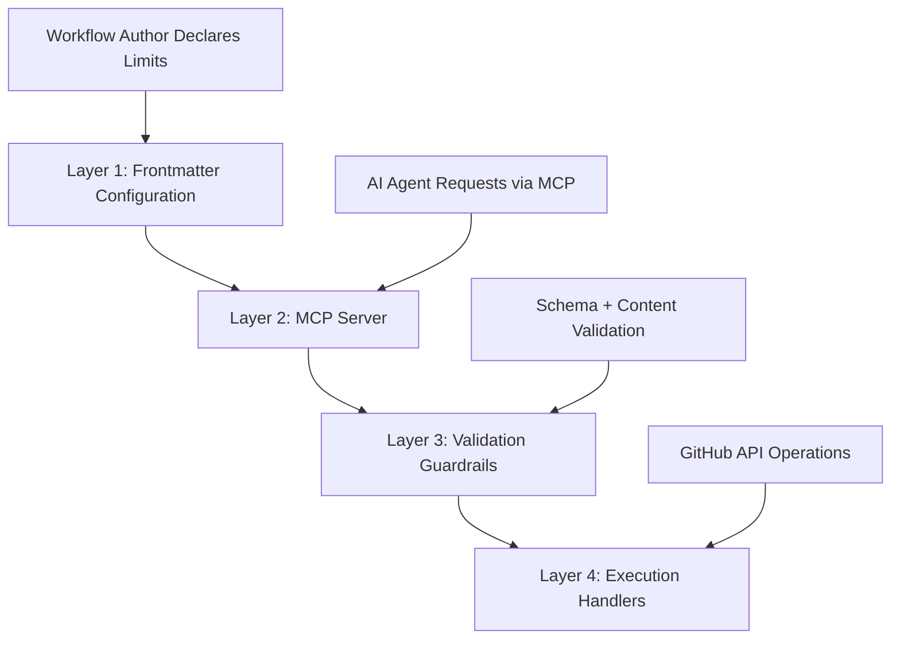
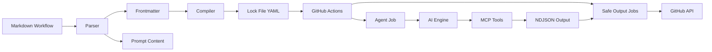
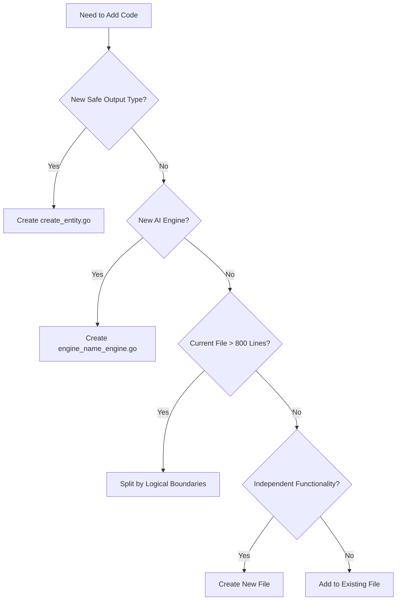
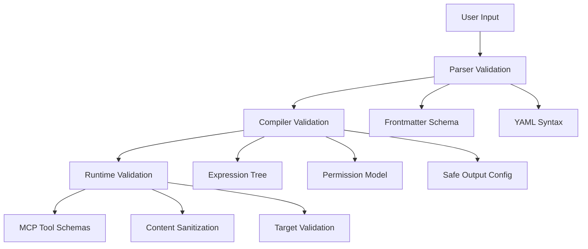
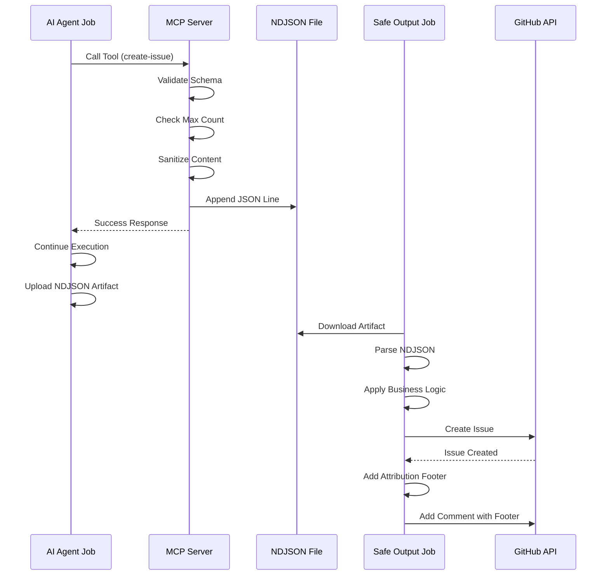
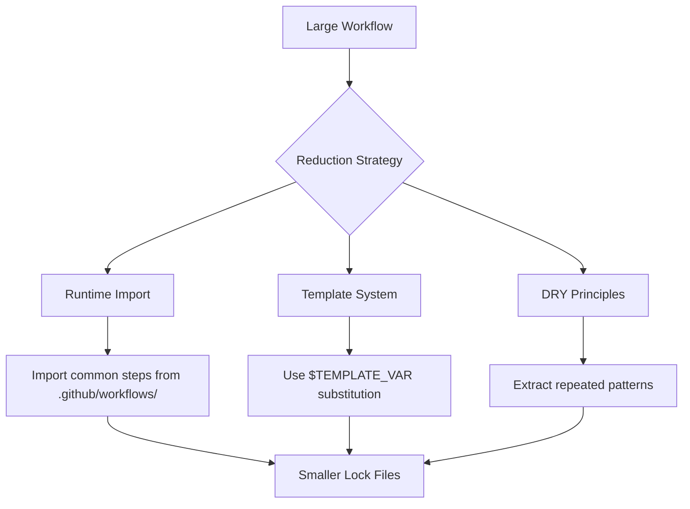
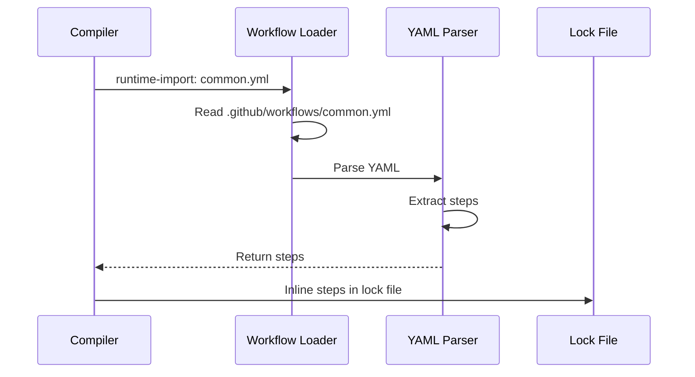
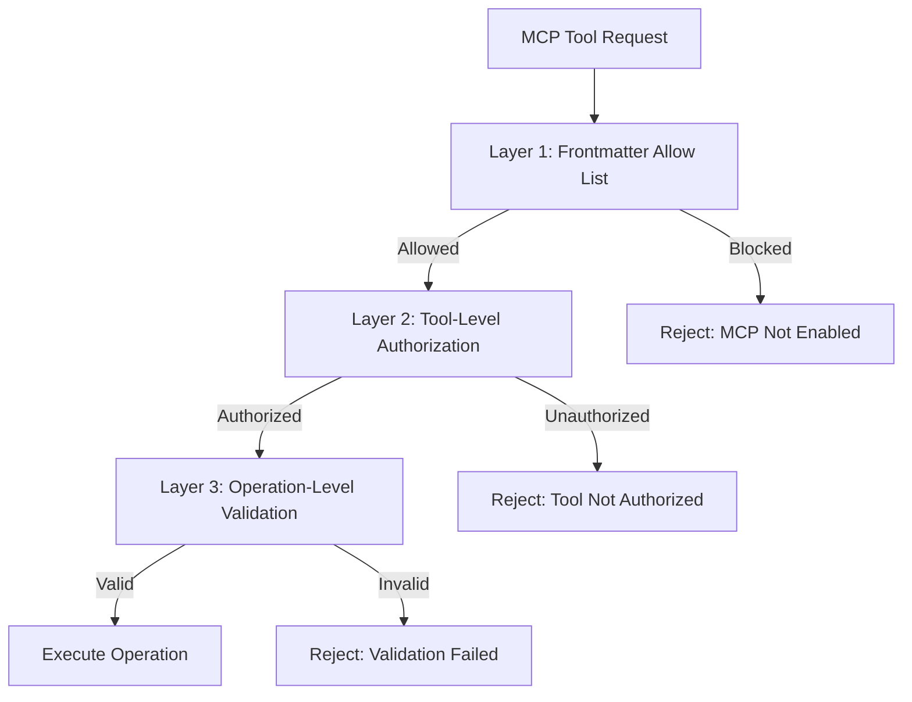
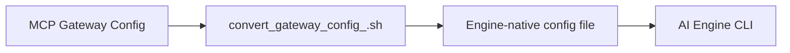

# Developer Instructions

**Version**: 2.5
**Last Updated**: 2026-02-19
**Purpose**: Consolidated development guidelines for GitHub Agentic Workflows

This document consolidates specifications from the scratchpad directory into unified developer instructions. It provides architecture patterns, security guidelines, code organization rules, and testing practices.

## Table of Contents

- [Core Architecture](#core-architecture)
- [Code Organization](#code-organization)
- [Validation Architecture](#validation-architecture)
- [Safe Outputs System](#safe-outputs-system)
- [Testing Guidelines](#testing-guidelines)
- [CLI Command Patterns](#cli-command-patterns)
- [Error Handling](#error-handling)
- [Security Best Practices](#security-best-practices)
- [Workflow Patterns](#workflow-patterns)
- [MCP Integration](#mcp-integration)
- [Go Type Patterns](#go-type-patterns)
- [Quick Reference](#quick-reference)

---

## Core Architecture

### Four-Layer Security Model

GitHub Agentic Workflows implements a four-layer security architecture that separates AI reasoning from write operations:



**Layer 1: Frontmatter Configuration**
- Workflow authors declare `safe-outputs:` in YAML frontmatter
- Defines operation limits, permissions, and constraints
- Compiled into GitHub Actions workflow jobs
- No runtime modification possible

**Layer 2: MCP Server**
- Exposes tools to AI agent via Model Context Protocol
- Accepts structured requests as JSON
- Operates with read-only permissions
- Collects output to NDJSON file without execution

**Layer 3: Validation Guardrails**
- Schema validation against JSON schemas
- Max count enforcement per operation type
- Label sanitization (removes `@` mentions, control characters)
- Cross-repository permission validation
- Target validation (`triggering`, `*`, or numeric ID)

**Layer 4: Execution Handlers**
- Separate GitHub Actions jobs with write permissions
- Execute validated operations via GitHub API
- Apply message templating and attribution footers
- Handle errors with fallback strategies

### Compilation and Runtime Flow



**Compilation Phase**:
1. Parse markdown workflow files
2. Extract frontmatter (YAML) and prompt content
3. Validate against schemas
4. Compile to GitHub Actions YAML (lock file)
5. Inject safe output job definitions

**Runtime Phase**:
1. GitHub Actions triggers workflow
2. Agent job executes with read-only permissions
3. AI engine processes prompt, calls MCP tools
4. MCP server validates and writes NDJSON
5. Safe output jobs read NDJSON and execute operations
6. Results posted to GitHub resources

---

## Code Organization

### File Organization Principles

**Prefer Many Small Files Over Large Ones**

Guideline: Files should typically be 100-500 lines. Split files exceeding 800 lines unless domain complexity justifies the size.

**Group by Functionality, Not by Type**

```go
// ✅ Good: Feature-based organization
create_issue.go            // Issue creation logic
create_issue_test.go       // Issue tests
add_comment.go             // Comment logic
add_comment_test.go        // Comment tests

// ❌ Avoid: Type-based organization
models.go                  // All structs
logic.go                   // All business logic
tests.go                   // All tests
```

**Use Descriptive File Names**

```go
// ✅ Good
create_pull_request_reviewers_test.go
engine_error_patterns_infinite_loop_test.go
copilot_mcp_http_integration_test.go

// ❌ Avoid
utils.go
helpers.go
misc.go
```

### File Creation Decision Tree



### Recommended Patterns

**1. Create Functions Pattern** (`create_*.go`)

Pattern: One file per GitHub entity creation operation

Examples:
- `create_issue.go` (160 lines) - GitHub issue creation
- `create_pull_request.go` (238 lines) - Pull request creation
- `create_discussion.go` (118 lines) - Discussion creation
- `create_code_scanning_alert.go` (136 lines) - Code scanning alerts

Rationale:
- Clear separation of concerns
- Enables quick location of functionality
- Prevents files from growing too large
- Facilitates parallel development

**2. Engine Separation Pattern**

Pattern: Each AI engine has its own file with shared helpers

Examples:
- `copilot_engine.go` (971 lines) - GitHub Copilot engine
- `claude_engine.go` (340 lines) - Claude engine
- `codex_engine.go` (639 lines) - Codex engine
- `custom_engine.go` (300 lines) - Custom engine support
- `engine_helpers.go` (424 lines) - Shared engine utilities

Rationale:
- Engine-specific logic isolated
- Shared code centralized
- New engines added without affecting existing ones
- Clear boundaries reduce merge conflicts

**3. Test Organization Pattern**

Pattern: Tests live alongside implementation with descriptive names

Examples:
- Feature tests: `feature.go` + `feature_test.go`
- Integration tests: `feature_integration_test.go`
- Scenario tests: `feature_scenario_test.go`

Rationale:
- Tests co-located with implementation
- Clear test purpose from filename
- Supports test coverage requirements

### Function Count Threshold

**Guideline**: Consider splitting files exceeding **50 functions**.

This is a guideline, not a hard rule. Domain complexity may justify larger files.

**Monitoring**: Run `make check-file-sizes` to identify files approaching the threshold.

**Current Justified Large Files**:
- `js.go` (41 functions, 914 lines) - JavaScript bundling with many embed directives
- `permissions.go` (37 functions, 945 lines) - Permission handling for GitHub Actions
- `scripts.go` (37 functions, 397 lines) - Script generation with specialized functions
- `compiler_safe_outputs_consolidated.go` (30 functions, 1267 lines) - Consolidated safe output handling

### Anti-Patterns to Avoid

**❌ God Files**
```go
// Don't create files like this
workflow.go (5000+ lines)  // Everything related to workflows
```

**❌ Vague Naming**
```go
// Avoid
utils.go
helpers.go
misc.go
common.go
```

**❌ Mixed Concerns**
```go
// In create_issue.go - DON'T DO THIS
func CreateIssue() {}
func ValidateNetwork() {}  // Unrelated!
func CompileYAML() {}      // Unrelated!
```

**❌ Premature Abstraction**
```go
// Don't create these preemptively
future_feature_helpers.go
maybe_needed_utils.go
```

**Solution**: Wait until 2-3 use cases emerge, then extract common patterns.

---

## Validation Architecture

### Validation Layers

GitHub Agentic Workflows implements validation at three levels:



### Parser Validation

**Responsibilities**:
- Validate frontmatter against JSON schemas
- Check YAML syntax correctness
- Verify required fields present
- Validate field types and formats

**Location**: `pkg/parser/`

**Key Files**:
- `frontmatter.go` - Frontmatter parsing and validation
- `schemas/` - JSON schema definitions
- `parser_test.go` - Parser validation tests

**Example Schema Validation**:
```go
// Validate frontmatter matches schema
func ValidateFrontmatter(data map[string]any) error {
    schema := loadSchema("workflow.schema.json")
    return schema.Validate(data)
}
```

### Compiler Validation

**Responsibilities**:
- Build and validate expression trees
- Verify permission model consistency
- Validate safe output configurations
- Check cross-references (imports, templates)

**Location**: `pkg/workflow/compiler.go`

**Expression Tree Validation**:
```go
// Expression tree nodes validated during compilation
type ExpressionNode struct {
    Type     NodeType
    Value    string
    Children []ExpressionNode
}

func (n *ExpressionNode) Validate() error {
    // Validate node type
    // Validate children recursively
    // Check for undefined variables
}
```

**Permission Validation**:
```go
// Validate permissions are consistent
func ValidatePermissions(perms map[string]string) error {
    for key, val := range perms {
        if !isValidPermission(key) {
            return fmt.Errorf("invalid permission: %s", key)
        }
        if !isValidPermissionValue(val) {
            return fmt.Errorf("invalid permission value: %s", val)
        }
    }
    return nil
}
```

### Runtime Validation

**Responsibilities**:
- Validate MCP tool requests against schemas
- Sanitize content (labels, titles, bodies)
- Validate targets (triggering, *, numeric)
- Enforce max count limits
- Validate cross-repository permissions

**Location**: `pkg/workflow/safe_outputs.go`, MCP server validation

**Content Sanitization**:
```go
// Label sanitization removes @ mentions and control characters
func SanitizeLabel(label string) string {
    // Remove @ characters
    label = strings.ReplaceAll(label, "@", "")
    // Remove control characters (0x00-0x1F, 0x7F-0x9F)
    label = removeControlCharacters(label)
    // Trim whitespace
    label = strings.TrimSpace(label)
    // Limit to 64 characters
    if len(label) > 64 {
        label = label[:64]
    }
    return label
}
```

**Target Validation**:
```go
// Validate target specification
func ValidateTarget(target string, event WorkflowEvent) error {
    switch target {
    case "triggering":
        // Requires issue, PR, or discussion event
        if !event.HasTriggeringResource() {
            return errors.New("target 'triggering' requires workflow triggered by issue/PR/discussion")
        }
    case "*":
        // Wildcard accepted
        return nil
    default:
        // Must be numeric
        if _, err := strconv.Atoi(target); err != nil {
            return fmt.Errorf("invalid target: must be 'triggering', '*', or numeric ID")
        }
    }
    return nil
}
```

### Validation Placement Guidelines

**When to add to centralized `validation.go`**:
- Schema validation logic
- Cross-cutting validation concerns
- Frontmatter field validation
- Generic extractors for primitive types

**When to use domain-specific validation**:
- Engine-specific validation in `<engine>_engine.go`
- Feature-specific validation alongside feature code
- Complex type parsers (e.g., `parseTitlePrefixFromConfig`)

**Example Domain-Specific Validation**:
```go
// In create_issue.go
func validateIssueConfig(cfg CreateIssueConfig) error {
    if cfg.TitlePrefix != "" && len(cfg.TitlePrefix) > 50 {
        return errors.New("title-prefix must be ≤50 characters")
    }
    if cfg.Max != 0 && cfg.Max > 100 {
        return errors.New("max must be ≤100")
    }
    return nil
}
```

---

## Safe Outputs System

### Architecture Overview

The Safe Outputs System enables AI agents to request write operations without possessing write permissions. See [Core Architecture](#core-architecture) for the four-layer model.

### Safe Outputs Data Flow



### Builtin System Tools

**Purpose**: Essential system functions independent of GitHub operations

**Auto-Enabled**: Yes, when any safe-outputs configured

**Tools**:

1. **`missing-tool`** - Report missing functionality
   - Creates GitHub issue (optional)
   - Logs to step summary
   - Default: Unlimited

2. **`missing-data`** - Report missing information
   - Creates GitHub issue (optional)
   - Logs to step summary
   - Default: Unlimited

3. **`noop`** - Signal completion without action
   - Logs message to step summary
   - No GitHub resources created
   - Default: Max 1

### GitHub Operations Categories

**Issues & Discussions**:
- `create-issue`, `update-issue`, `close-issue`
- `link-sub-issue`
- `create-discussion`, `update-discussion`, `close-discussion`

**Pull Requests**:
- `create-pull-request`, `update-pull-request`, `close-pull-request`
- `create-pull-request-review-comment`
- `push-to-pull-request-branch`

**Labels, Assignments & Reviews**:
- `add-comment`, `hide-comment`
- `add-labels`, `add-reviewer`
- `assign-milestone`, `assign-to-agent`, `assign-to-user`

**Projects, Releases & Assets**:
- `create-project`, `update-project`
- `create-project-status-update`
- `update-release`, `upload-asset`

**Security & Agent Tasks**:
- `create-code-scanning-alert`
- `create-agent-session`

### Common Configuration Patterns

**Max Count**:
```yaml
safe-outputs:
  create-issue:
    max: 5          # Limit to 5 issues
  add-comment:
    max: 0          # Unlimited (use with caution)
```

**Title Prefix**:
```yaml
safe-outputs:
  create-issue:
    title-prefix: "[ai] "  # Prepended to titles
```

**Labels**:
```yaml
safe-outputs:
  create-issue:
    labels: [automation, ai-generated]      # Always applied
    allowed-labels: [bug, enhancement]      # Restrict agent choices
```

**Cross-Repository**:
```yaml
safe-outputs:
  create-issue:
    target-repo: "owner/repo"  # Create in different repository
```

**Target Specification**:
```yaml
safe-outputs:
  add-comment:
    target: "triggering"  # Comment on triggering issue/PR
    # OR
    target: "*"           # Agent specifies target
    # OR
    target: 123           # Always comment on #123
```

**Staged Mode**:
```yaml
safe-outputs:
  create-issue:
    staged: true  # Preview without execution
```

### Attribution Footers

All GitHub content created by safe outputs includes attribution:

```markdown
> AI generated by [WorkflowName](run_url)
```

With context for triggering resource:
```markdown
> AI generated by [WorkflowName](run_url) for #123
```

**Implementation**:
```go
func generateAttribution(workflowName, runURL string, issue int) string {
    if issue > 0 {
        return fmt.Sprintf("> AI generated by [%s](%s) for #%d",
            workflowName, runURL, issue)
    }
    return fmt.Sprintf("> AI generated by [%s](%s)",
        workflowName, runURL)
}
```

---

## Testing Guidelines

### Test Organization

**Test File Naming**:
- Unit tests: `feature_test.go`
- Integration tests: `feature_integration_test.go`
- Scenario tests: `feature_scenario_test.go`
- Backward compatibility: `feature_backward_compat_test.go`

**Test Categories**:

1. **Unit Tests** - Test individual functions in isolation
2. **Integration Tests** - Test component interactions
3. **End-to-End Tests** - Test full workflows via GitHub Actions
4. **Visual Regression Tests** - Test terminal output rendering

### Unit Test Patterns

**Table-Driven Tests**:
```go
func TestValidateLabel(t *testing.T) {
    tests := []struct {
        name     string
        input    string
        expected string
    }{
        {"removes @", "@user", "user"},
        {"trims space", "  label  ", "label"},
        {"limits length", strings.Repeat("a", 100), strings.Repeat("a", 64)},
    }

    for _, tt := range tests {
        t.Run(tt.name, func(t *testing.T) {
            result := SanitizeLabel(tt.input)
            if result != tt.expected {
                t.Errorf("got %q, want %q", result, tt.expected)
            }
        })
    }
}
```

**Test Fixtures**:
```go
// Use testdata/ directory for fixtures
func TestParseWorkflow(t *testing.T) {
    data, err := os.ReadFile("testdata/workflow.md")
    require.NoError(t, err)

    wf, err := ParseWorkflow(data)
    require.NoError(t, err)
    assert.Equal(t, "Test Workflow", wf.Name)
}
```

### Integration Test Patterns

**Mock GitHub API**:
```go
func TestCreateIssue_Integration(t *testing.T) {
    // Create mock GitHub server
    server := httptest.NewServer(http.HandlerFunc(func(w http.ResponseWriter, r *http.Request) {
        assert.Equal(t, "POST", r.Method)
        assert.Equal(t, "/repos/owner/repo/issues", r.URL.Path)

        w.WriteHeader(http.StatusCreated)
        json.NewEncoder(w).Encode(map[string]any{
            "number": 123,
            "title": "Test Issue",
        })
    }))
    defer server.Close()

    // Test issue creation
    client := github.NewClient(server.URL)
    issue, err := CreateIssue(client, "Test Issue", "Body")
    require.NoError(t, err)
    assert.Equal(t, 123, issue.Number)
}
```

### End-to-End Testing

**GitHub Actions Workflows**:
- `dev.md` - Development workflow for testing features
- `dev-hawk.md` - Additional testing workflow
- Workflows test compilation, execution, and safe outputs

**Testing Checklist**:
1. ✅ Workflow compiles without errors
2. ✅ Agent job executes with correct permissions
3. ✅ MCP tools registered and callable
4. ✅ Safe output jobs execute correctly
5. ✅ Attribution footers added
6. ✅ Max counts enforced
7. ✅ Cross-repository operations work
8. ✅ Staged mode prevents execution

### Visual Regression Testing

**Terminal Output Testing**:
```go
func TestRenderWorkflowStatus(t *testing.T) {
    // Capture terminal output
    buf := new(bytes.Buffer)
    theme := styles.NewTheme()

    RenderWorkflowStatus(buf, theme, WorkflowStatus{
        Name: "Test",
        Status: "success",
    })

    output := buf.String()
    assert.Contains(t, output, "✓")
    assert.Contains(t, output, "Test")
    assert.Contains(t, output, "success")
}
```

### Test Coverage Requirements

**Minimum Coverage**:
- Unit tests: 80% coverage for core logic
- Integration tests: Critical paths covered
- End-to-end tests: Major features validated

**Coverage Reporting**:
```bash
go test -coverprofile=coverage.out ./...
go tool cover -html=coverage.out
```

**Coverage Exclusions**:
- Generated code
- Trivial getters/setters
- Debug utilities

---

## CLI Command Patterns

### Command Structure

GitHub Agentic Workflows CLI (`gh-aw`) follows consistent command patterns:

```bash
gh aw <command> [flags] [arguments]
```

**Command Categories**:
- **Workflow Management**: `run`, `compile`, `validate`
- **Safe Outputs**: `safe-outputs`
- **Utilities**: `version`, `help`

### Command Implementation Pattern

**Structure**:
```go
// cmd/gh-aw/command_name.go
func NewCommandName() *cobra.Command {
    cmd := &cobra.Command{
        Use:   "command-name [args]",
        Short: "Brief description",
        Long:  "Detailed description with examples",
        Args:  cobra.ExactArgs(1),
        RunE: func(cmd *cobra.Command, args []string) error {
            return runCommandName(cmd, args)
        },
    }

    // Add flags
    cmd.Flags().StringP("flag", "f", "default", "flag description")

    return cmd
}

func runCommandName(cmd *cobra.Command, args []string) error {
    // Implementation
    return nil
}
```

### Flag Conventions

**Flag Naming**:
- Lowercase with hyphens: `--output-file`
- Short flags single letter: `-o`
- Boolean flags no value: `--verbose`

**Common Flags**:
```go
--output, -o      Output file path
--verbose, -v     Verbose output
--debug, -d       Debug mode
--help, -h        Help information
```

### Input Validation

**Command Arguments**:
```go
// Validate argument count
cmd := &cobra.Command{
    Args: cobra.ExactArgs(1),  // Exactly 1 argument
    // OR
    Args: cobra.MinimumNArgs(1),  // At least 1 argument
    // OR
    Args: cobra.RangeArgs(1, 3),  // Between 1 and 3 arguments
}
```

**Flag Validation**:
```go
// Validate flag values
func runCommand(cmd *cobra.Command, args []string) error {
    outputFile, _ := cmd.Flags().GetString("output")
    if outputFile == "" {
        return errors.New("--output flag required")
    }

    if !filepath.IsAbs(outputFile) {
        return errors.New("--output must be absolute path")
    }

    return nil
}
```

### Output Formatting

**Terminal Output**:
```go
// Use styles package for consistent formatting
theme := styles.NewTheme()

// Success messages
fmt.Fprintln(os.Stdout, theme.Success("✓ Operation successful"))

// Error messages
fmt.Fprintln(os.Stderr, theme.Error("✗ Operation failed"))

// Info messages
fmt.Fprintln(os.Stdout, theme.Info("ℹ Information"))

// Warnings
fmt.Fprintln(os.Stdout, theme.Warning("⚠ Warning message"))
```

**JSON Output**:
```go
// Support --output=json flag for machine-readable output
if outputFormat == "json" {
    data := map[string]any{
        "status": "success",
        "result": result,
    }
    enc := json.NewEncoder(os.Stdout)
    enc.SetIndent("", "  ")
    return enc.Encode(data)
}
```

### Error Handling

**Error Messages**:
```go
// Descriptive error messages with context
return fmt.Errorf("failed to compile workflow %q: %w", workflowPath, err)

// Use errors.Is and errors.As for error type checking
if errors.Is(err, ErrWorkflowNotFound) {
    return fmt.Errorf("workflow not found: %s", workflowPath)
}
```

**Exit Codes**:
```go
// Standard exit codes
const (
    ExitSuccess = 0   // Successful execution
    ExitError   = 1   // General error
    ExitUsage   = 2   // Usage error (invalid flags/args)
)

// Set exit code in RunE
func runCommand(cmd *cobra.Command, args []string) error {
    if err := validate(args); err != nil {
        cmd.SilenceUsage = false  // Show usage on validation error
        return err
    }

    if err := execute(); err != nil {
        cmd.SilenceUsage = true  // Don't show usage on execution error
        return err
    }

    return nil
}
```

---

## Error Handling

### Error Patterns

**Error Types**:
```go
// Define custom error types
var (
    ErrWorkflowNotFound   = errors.New("workflow not found")
    ErrInvalidFrontmatter = errors.New("invalid frontmatter")
    ErrCompilationFailed  = errors.New("compilation failed")
)

// Use errors.Is for checking
if errors.Is(err, ErrWorkflowNotFound) {
    // Handle not found
}
```

**Wrapped Errors**:
```go
// Wrap errors to add context
func CompileWorkflow(path string) error {
    data, err := os.ReadFile(path)
    if err != nil {
        return fmt.Errorf("failed to read workflow %q: %w", path, err)
    }

    wf, err := ParseWorkflow(data)
    if err != nil {
        return fmt.Errorf("failed to parse workflow %q: %w", path, err)
    }

    return nil
}

// Unwrap errors
baseErr := errors.Unwrap(err)
```

### Infinite Loop Detection

**Engine Error Patterns**:
```go
// Detect infinite loops in AI engine responses
type LoopDetector struct {
    history []string
    maxSize int
}

func (d *LoopDetector) Add(response string) bool {
    d.history = append(d.history, response)
    if len(d.history) > d.maxSize {
        d.history = d.history[1:]
    }

    // Check for repeated responses
    if len(d.history) >= 3 {
        last3 := d.history[len(d.history)-3:]
        if last3[0] == last3[1] && last3[1] == last3[2] {
            return true  // Loop detected
        }
    }

    return false
}
```

### Error Recovery Strategies

**Retry with Exponential Backoff**:
```go
func retryWithBackoff(operation func() error, maxRetries int) error {
    var err error
    backoff := time.Second

    for i := 0; i < maxRetries; i++ {
        err = operation()
        if err == nil {
            return nil
        }

        if !isRetryable(err) {
            return err
        }

        time.Sleep(backoff)
        backoff *= 2
        if backoff > time.Minute {
            backoff = time.Minute
        }
    }

    return fmt.Errorf("operation failed after %d retries: %w", maxRetries, err)
}

func isRetryable(err error) bool {
    // Check if error is retryable (network, rate limit, etc.)
    return errors.Is(err, ErrRateLimited) ||
           errors.Is(err, ErrNetworkTimeout)
}
```

**Fallback Strategies**:
```go
// Attempt primary operation, fallback on failure
func createResource(ctx context.Context) error {
    err := createResourcePrimary(ctx)
    if err == nil {
        return nil
    }

    log.Printf("primary creation failed: %v, attempting fallback", err)
    return createResourceFallback(ctx)
}
```

**Graceful Degradation**:
```go
// Continue processing remaining items on individual failures
func processItems(items []Item) error {
    var errs []error

    for _, item := range items {
        if err := processItem(item); err != nil {
            errs = append(errs, fmt.Errorf("item %s: %w", item.ID, err))
            continue  // Continue with next item
        }
    }

    if len(errs) > 0 {
        return fmt.Errorf("failed to process %d items: %v", len(errs), errs)
    }

    return nil
}
```

---

## Security Best Practices

### GitHub Actions Security

**Token Permissions**:
```yaml
# Use minimal permissions
permissions:
  contents: read          # Read repository contents
  issues: write           # Create/modify issues (when needed)
  pull-requests: write    # Create/modify PRs (when needed)

# ❌ Avoid
permissions: write-all    # Too broad
```

**Secret Management**:
```yaml
# Access secrets only when needed
steps:
  - name: Operation requiring secret
    env:
      TOKEN: ${{ secrets.CUSTOM_TOKEN }}
    run: |
      # Use TOKEN here
```

**Pinned Actions**:
```yaml
# ✅ Pin actions to SHA
- uses: actions/checkout@8e5e7e5ab8b370d6c329ec480221332ada57f0ab  # v3.5.2

# ❌ Avoid unpinned versions
- uses: actions/checkout@v3
```

### Input Validation

**User Input Sanitization**:
```go
// Validate and sanitize all user inputs
func ValidateTitle(title string) error {
    // Trim whitespace
    title = strings.TrimSpace(title)

    // Check for empty
    if title == "" {
        return errors.New("title cannot be empty")
    }

    // Check length
    if len(title) > 256 {
        return errors.New("title must be ≤256 characters")
    }

    // Check for control characters
    if containsControlCharacters(title) {
        return errors.New("title contains invalid characters")
    }

    return nil
}
```

**Label Sanitization**:
```go
// Remove @ mentions and control characters from labels
func SanitizeLabel(label string) string {
    // Remove @ characters to prevent mentions
    label = strings.ReplaceAll(label, "@", "")

    // Remove control characters (0x00-0x1F, 0x7F-0x9F)
    var builder strings.Builder
    for _, r := range label {
        if r >= 0x20 && r < 0x7F || r > 0x9F {
            builder.WriteRune(r)
        }
    }

    label = builder.String()

    // Trim whitespace
    label = strings.TrimSpace(label)

    // Limit length
    if len(label) > 64 {
        label = label[:64]
    }

    return label
}
```

### Template Injection Prevention

**Safe Template Evaluation**:
```go
// Use structured data instead of string interpolation
type TemplateData struct {
    Title string
    Body  string
    User  string
}

// ✅ Good: Structured template with validated data
func renderTemplate(data TemplateData) (string, error) {
    tmpl := template.New("issue")
    tmpl, err := tmpl.Parse("Title: {{.Title}}\nBody: {{.Body}}")
    if err != nil {
        return "", err
    }

    var buf bytes.Buffer
    if err := tmpl.Execute(&buf, data); err != nil {
        return "", err
    }

    return buf.String(), nil
}

// ❌ Avoid: String interpolation with user input
func renderUnsafe(title, body string) string {
    return fmt.Sprintf("Title: %s\nBody: %s", title, body)
}
```

**Expression Sanitization**:
```go
// Validate GitHub Actions expressions before use
func ValidateExpression(expr string) error {
    // Check for allowed patterns
    allowedPatterns := []string{
        `^\$\{\{ github\.[a-z_]+ \}\}$`,
        `^\$\{\{ secrets\.[A-Z_]+ \}\}$`,
        `^\$\{\{ inputs\.[a-z_]+ \}\}$`,
    }

    for _, pattern := range allowedPatterns {
        if match, _ := regexp.MatchString(pattern, expr); match {
            return nil
        }
    }

    return fmt.Errorf("invalid expression: %s", expr)
}
```

### Security Scanning

**gosec Integration**:
```bash
# Run gosec for security scanning
make gosec

# Or directly
gosec ./...
```

**Common Issues Detected**:
- G101: Hardcoded credentials
- G104: Unhandled errors
- G204: Command injection via subprocess
- G304: File inclusion via variable

**Suppression**:
```go
// Suppress false positives with comment
func readFile(path string) ([]byte, error) {
    // #nosec G304 -- path validated by caller
    return os.ReadFile(path)
}
```

---

## Workflow Patterns

### Workflow Size Reduction Strategies



### Runtime Import Pattern

**Purpose**: Import steps from GitHub Actions workflow files at runtime

**Syntax**:
```yaml
steps:
  - runtime-import: .github/workflows/common-setup.yml
  - runtime-import: .github/workflows/test-runner.yml
```

**Import Processing**:


**Benefits**:
- Reduces duplication across workflows
- Centralizes common patterns
- Enables versioning of shared steps
- Maintains workflow clarity

**Example**:
```yaml
# .github/workflows/common-setup.yml
steps:
  - uses: actions/checkout@v3
  - uses: actions/setup-go@v4
    with:
      go-version: '1.21'

# workflow.md
steps:
  - runtime-import: .github/workflows/common-setup.yml
  - run: go test ./...
```

### Template Variables

**Purpose**: Parameterize workflow configurations

**Syntax**:
```yaml
env:
  DATABASE_URL: $TEMPLATE_DB_URL
  API_KEY: $TEMPLATE_API_KEY
```

**Substitution**:
```go
// Template substitution during compilation
func substituteTemplates(content string, vars map[string]string) string {
    for key, val := range vars {
        placeholder := "$TEMPLATE_" + key
        content = strings.ReplaceAll(content, placeholder, val)
    }
    return content
}
```

### Workflow Composition

**Parent-Child Workflows**:
```yaml
# parent.md
---
name: Parent Workflow
trigger: issue_comment
---

Based on the comment, route to specialized workflows:
- Bug reports → bug-triage.md
- Feature requests → feature-analysis.md
- Questions → qa-responder.md
```

**Workflow Orchestration**:
```go
// Trigger child workflows based on conditions
func routeWorkflow(event Event) (string, error) {
    switch detectIntent(event.Comment) {
    case IntentBug:
        return "bug-triage.md", nil
    case IntentFeature:
        return "feature-analysis.md", nil
    case IntentQuestion:
        return "qa-responder.md", nil
    default:
        return "", errors.New("unable to route workflow")
    }
}
```

---

## MCP Integration

### MCP Access Control

GitHub Agentic Workflows implements three-layer access control for MCP servers:



**Layer 1: Frontmatter Allow List**

Workflow authors explicitly enable MCP servers:

```yaml
mcp:
  servers:
    - name: github
      enabled: true
    - name: filesystem
      enabled: false  # Explicitly disabled
```

Only enabled MCPs can be used by the AI agent.

**Layer 2: Tool-Level Authorization**

Each MCP tool has authorization requirements:

```typescript
// MCP server tool registration
server.registerTool({
  name: "create_issue",
  description: "Create a GitHub issue",
  inputSchema: createIssueSchema,
  authorization: {
    required: true,
    scopes: ["issues:write"],
  },
  handler: async (params) => {
    // Tool implementation
  },
});
```

**Layer 3: Operation-Level Validation**

Each operation validates request parameters:

```typescript
// Validate operation parameters
function validateCreateIssue(params: any): ValidationResult {
  if (!params.title || params.title.trim() === "") {
    return { valid: false, error: "Title required" };
  }

  if (params.title.length > 256) {
    return { valid: false, error: "Title too long" };
  }

  return { valid: true };
}
```

### MCP Server Configuration

**Server Registration**:
```yaml
# .github/agents/mcp-servers.yml
servers:
  github:
    command: node
    args: [dist/github-mcp-server/index.js]
    env:
      GITHUB_TOKEN: ${{ secrets.GITHUB_TOKEN }}

  filesystem:
    command: node
    args: [dist/filesystem-mcp-server/index.js]
    env:
      ROOT_PATH: /workspace
```

**Runtime Configuration**:
```go
// Load MCP server configuration
func LoadMCPConfig(path string) (*MCPConfig, error) {
    data, err := os.ReadFile(path)
    if err != nil {
        return nil, fmt.Errorf("failed to read MCP config: %w", err)
    }

    var config MCPConfig
    if err := yaml.Unmarshal(data, &config); err != nil {
        return nil, fmt.Errorf("failed to parse MCP config: %w", err)
    }

    return &config, nil
}
```

### Engine-Specific MCP Config Delivery

Some AI engine CLIs do not support a `--mcp-config` flag and instead read MCP server configuration from engine-native config files. When implementing `RenderMCPConfig()` for such engines, write configuration to the engine's expected location rather than passing it via CLI flag.

**Pattern: Standard CLI flag** (Claude, Copilot, Codex):
```go
// Engine reads MCP config from --mcp-config flag
args = append(args, "--mcp-config", "/tmp/gh-aw/mcp-config/mcp-servers.json")
```

**Pattern: Engine-native config file** (Gemini):
```bash
# Gemini CLI does not support --mcp-config flag
# Use a conversion script to write to .gemini/settings.json instead
actions/setup/sh/convert_gateway_config_gemini.sh
# Writes MCP server configuration to .gemini/settings.json (project-level)
```

**Implementation**: Use a shell script in `actions/setup/sh/` to convert the MCP gateway config to the engine's native format. Route the engine to this script via `start_mcp_gateway.sh`.



When adding a new engine, check the engine CLI's documentation to determine whether it supports `--mcp-config` or requires an alternative config delivery method.

---

### MCP Logs Guardrail

**Purpose**: Prevent sensitive information leakage in MCP logs

**Implementation**:
```go
// Sanitize MCP logs before writing
func SanitizeMCPLog(log string) string {
    // Patterns to redact
    patterns := []struct {
        pattern *regexp.Regexp
        replacement string
    }{
        {regexp.MustCompile(`ghp_[a-zA-Z0-9]{36}`), "[REDACTED_TOKEN]"},
        {regexp.MustCompile(`ghs_[a-zA-Z0-9]{36}`), "[REDACTED_SECRET]"},
        {regexp.MustCompile(`Bearer\s+[^\s]+`), "Bearer [REDACTED]"},
    }

    result := log
    for _, p := range patterns {
        result = p.pattern.ReplaceAllString(result, p.replacement)
    }

    return result
}
```

**Log Levels**:
```go
// MCP log levels
const (
    LogLevelDebug = "debug"  // Detailed debugging info
    LogLevelInfo  = "info"   // General information
    LogLevelWarn  = "warn"   // Warning messages
    LogLevelError = "error"  // Error messages
)

// Set log level based on environment
func GetMCPLogLevel() string {
    if os.Getenv("DEBUG") == "true" {
        return LogLevelDebug
    }
    return LogLevelInfo
}
```

---

## Go Type Patterns

### Type Safety Guidelines

**Use Strongly-Typed Structs**:
```go
// ✅ Good: Strongly-typed configuration
type CreateIssueConfig struct {
    Max          int      `json:"max"`
    TitlePrefix  string   `json:"title-prefix"`
    Labels       []string `json:"labels"`
    TargetRepo   string   `json:"target-repo"`
    Staged       bool     `json:"staged"`
}

// ❌ Avoid: map[string]any for configuration
var config map[string]any
```

**Use Constants for String Enums**:
```go
// Define string constants
type PermissionLevel string

const (
    PermissionRead  PermissionLevel = "read"
    PermissionWrite PermissionLevel = "write"
    PermissionAdmin PermissionLevel = "admin"
)

// ✅ Good: Type-safe permission
func SetPermission(level PermissionLevel) {
    // Compiler enforces valid values
}

// ❌ Avoid: String literals
func SetPermission(level string) {
    // No compile-time validation
}
```

**Use Typed Errors**:
```go
// Define error types
type WorkflowError struct {
    Path    string
    Message string
    Err     error
}

func (e *WorkflowError) Error() string {
    return fmt.Sprintf("workflow %s: %s", e.Path, e.Message)
}

func (e *WorkflowError) Unwrap() error {
    return e.Err
}

// ✅ Good: Typed error
return &WorkflowError{
    Path:    workflowPath,
    Message: "compilation failed",
    Err:     err,
}
```

### JSON Schema Validation

**Schema Definition**:
```go
// Define JSON schema for validation
const workflowSchema = `{
  "type": "object",
  "properties": {
    "name": {"type": "string", "minLength": 1},
    "trigger": {"type": "string", "enum": ["push", "pull_request", "issue_comment"]},
    "permissions": {"type": "object"}
  },
  "required": ["name", "trigger"]
}`

// Validate against schema
func ValidateWorkflow(data map[string]any) error {
    schema, err := jsonschema.Compile(workflowSchema)
    if err != nil {
        return err
    }

    return schema.Validate(data)
}
```

### Pointer vs Value Receivers

**Guidelines**:
```go
// Use pointer receivers when:
// - Method mutates the receiver
// - Struct is large (>few words)
// - Consistency with other methods

type Workflow struct {
    Name    string
    Trigger string
    Jobs    []Job
}

// ✅ Pointer receiver: mutates state
func (w *Workflow) AddJob(job Job) {
    w.Jobs = append(w.Jobs, job)
}

// ✅ Value receiver: read-only, small struct
type Point struct {
    X, Y int
}

func (p Point) Distance() float64 {
    return math.Sqrt(float64(p.X*p.X + p.Y*p.Y))
}
```

### Interface Design

**Small, Focused Interfaces**:
```go
// ✅ Good: Small, focused interfaces
type Reader interface {
    Read(p []byte) (n int, err error)
}

type Writer interface {
    Write(p []byte) (n int, err error)
}

type ReadWriter interface {
    Reader
    Writer
}

// ❌ Avoid: Large, unfocused interfaces
type Everything interface {
    Read(p []byte) (n int, err error)
    Write(p []byte) (n int, err error)
    Close() error
    Seek(offset int64, whence int) (int64, error)
    // ... many more methods
}
```

---

## Quick Reference

### File Organization

| Scenario | Pattern | Example |
|----------|---------|---------|
| New safe output | `create_<entity>.go` | `create_issue.go` |
| New AI engine | `<engine>_engine.go` | `claude_engine.go` |
| Shared helpers | `<subsystem>_helpers.go` | `engine_helpers.go` |
| Cohesive feature | `<feature>.go` | `expressions.go` |

### Validation Placement

| Type | Location | Example |
|------|----------|---------|
| Schema validation | `pkg/parser/` | Frontmatter schemas |
| Cross-cutting validation | `pkg/workflow/validation.go` | Permission validation |
| Engine-specific | `<engine>_engine.go` | Copilot config validation |
| Feature-specific | Alongside feature code | Issue config validation |

### Safe Output Defaults

| Operation | Max Default | Cross-Repo | Permissions |
|-----------|-------------|------------|-------------|
| `create-issue` | 1 | ✅ | `issues: write` |
| `create-pull-request` | 1 | ✅ | `contents: write`, `pull-requests: write` |
| `add-comment` | 1 | ✅ | `issues: write` or `pull-requests: write` |
| `missing-tool` | 0 (unlimited) | N/A | Optional `issues: write` |
| `noop` | 1 | N/A | None |

### Common Validation Patterns

| Validation | Method | Example |
|------------|--------|---------|
| Label sanitization | Remove `@`, control chars | `@user` → `user` |
| Title validation | Trim, check empty, limit length | Max 256 chars |
| Target validation | Check `triggering`, `*`, numeric | Requires event context |
| Max count | Track operations, reject excess | Default: 1 per type |

### Error Handling

| Pattern | Use Case | Example |
|---------|----------|---------|
| Wrap errors | Add context | `fmt.Errorf("failed to X: %w", err)` |
| Custom errors | Domain errors | `var ErrNotFound = errors.New("not found")` |
| Retry with backoff | Transient failures | Network errors, rate limits |
| Graceful degradation | Partial failures | Process remaining items |

### Testing

| Test Type | File Pattern | Purpose |
|-----------|-------------|---------|
| Unit | `feature_test.go` | Test individual functions |
| Integration | `feature_integration_test.go` | Test component interactions |
| E2E | `.github/workflows/dev.md` | Test full workflows |
| Scenario | `feature_scenario_test.go` | Test specific scenarios |

### Security Checklist

- ✅ Use minimal GitHub Actions permissions
- ✅ Pin actions to SHA
- ✅ Sanitize user inputs (labels, titles)
- ✅ Validate expressions before evaluation
- ✅ Run gosec for security scanning
- ✅ Redact sensitive data in logs
- ✅ Use structured templates, not string interpolation

### CLI Commands

| Command | Purpose | Example |
|---------|---------|---------|
| `gh aw run` | Execute workflow | `gh aw run workflow.md` |
| `gh aw compile` | Compile to YAML | `gh aw compile workflow.md` |
| `gh aw validate` | Validate workflow | `gh aw validate workflow.md` |
| `gh aw safe-outputs` | Test safe outputs | `gh aw safe-outputs --staged` |

---

## Additional Resources

### Related Documentation

- [Safe Outputs Specification](./safe-outputs-specification.md) - W3C-style formal specification
- [Validation Architecture](./validation-architecture.md) - Detailed validation patterns
- [GitHub Actions Security](./github-actions-security-best-practices.md) - Security guidelines
- [Code Organization](./code-organization.md) - Detailed file organization patterns

### External References

- [GitHub Actions Documentation](https://docs.github.com/actions)
- [Model Context Protocol](https://modelcontextprotocol.io/)
- [Go Code Review Comments](https://github.com/golang/go/wiki/CodeReviewComments)
- [gosec Security Scanner](https://github.com/securego/gosec)

---

**Document History**:
- v2.5 (2026-02-19): Fixed 6 tone issues in engine review docs, added Engine-Specific MCP Config Delivery section (Gemini pattern), analyzed 61 files
- v2.4 (2026-02-17): Quality verification - analyzed 4 new files, zero tone issues found across all 61 files
- v2.3 (2026-02-16): Quality verification - zero tone issues, all formatting standards maintained
- v2.2 (2026-02-15): Quality verification with metadata update
- v2.1 (2026-02-14): Quality verification
- v2.0 (2026-02-12): Major consolidation with Mermaid diagrams, technical tone improvements
- v1.0 (2026-02-11): Initial consolidated version

**Maintenance**: This document is automatically updated through the documentation consolidation workflow. For corrections or additions, update source specifications in `scratchpad/` and run the consolidation workflow.
